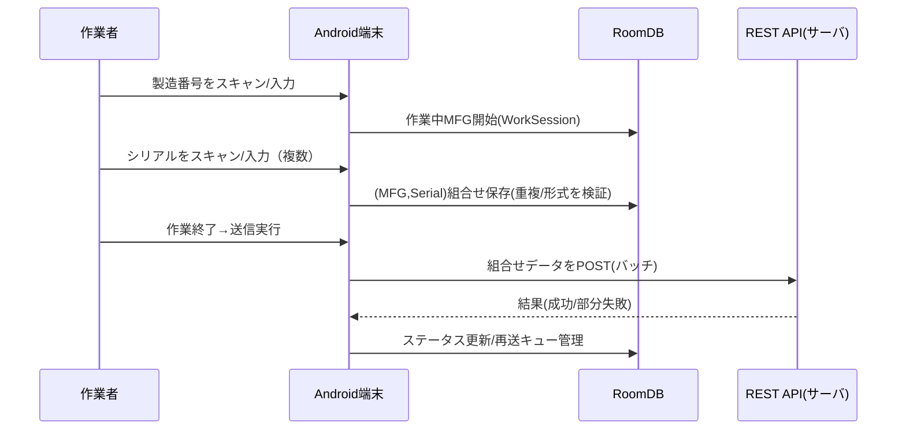

# Androidアプリ設計仕様書（初版）

## 1. 目的・範囲
- **目的**：機能検査工程で読み取った「製造番号（MFG）」と「シリアル番号」を組み合わせ、端末内に保持し、作業終了後にREST APIでサーバーへ送信する。
- **範囲**：端末内データ管理（RoomDB）、スキャン/入力、ローカル検証、送信、エラー再送。サーバー→端末の取得は**行わない**（送信のみ）。
- **対象端末**：キーエンス DX-A800
- **OSバージョン**：Android 13 (API 33)
- **備考**：商用アプリではないため、古いAPI対応や下位互換は不要

## 2. 非機能要件（抜粋）
- **言語/主要ライブラリ**：Kotlin、Room、Retrofit2、OkHttp、Kotlin Coroutines、Hilt
- **オフライン耐性**：完全オフラインでスキャン・登録可能。送信はオンライン時に実施/再試行。
- **セキュリティ**：通信はHTTPS必須。認証はBearerトークン（JWT等）を想定（運用仕様に合わせて差替可）。端末DBはアプリスコープで保護。

## 3. 画面設計（MVP）

### 1. **画面構成**

#### 1. ログイン画面
   - 目的：ユーザー認証
   - 機能
      - ユーザーID入力欄（EditText, id: userIdEdit）
      - パスワード入力欄（EditText, id: passwordEdit）
      - ログインボタン（Button, id: loginButton）
      - エラーメッセージ表示（TextView, id: errorText）
   - 挙動
      認証成功 → メイン画面に遷移
      認証失敗 → エラーメッセージ表示

#### 2. メイン画面
   - 目的：製造番号・シリアル番号の入力および確認
   - 機能
      - 製造番号入力ボタン：
        - 押下するとポップアップ（ダイアログ）表示
        - DX-A800標準スキャナーでQR読み取り／手入力フォールバック
        - 入力後、メイン画面の作業中MFGに登録
      - シリアル番号入力ボタン：
        - 押下するとポップアップ表示
        - DX-A800標準スキャナーでQR読み取り／手入力フォールバック
        - 入力後、現在のMFGに逐次追加
      - 確認ボタン：確認画面に遷移
      - 同期ボタン：DBサーバーへ手動送信
      - ハンバーガーメニュー
        - ログアウト
        - 設定（エンドポイントURL、トークン、スキャン挙動など）
   - 表示
      未送信件数／エラー件数／最終送信時刻などステータス表示

### 2.1 ポップアップ設計（詳細）

- 製造番号入力ボタン／シリアル番号入力ボタン押下時に、  
  下記のポップアップ（ダイアログ）を表示する。

#### ポップアップ共通仕様
- タイトル：「製造番号をスキャンしてください。」または「シリアル番号をスキャンしてください。」（押されたボタンに応じて切替）
- サブテキスト：スキャナーで読み取るか、手入力してください。
- 入力欄：EditText（手入力用）
- スキャンボタン：DX-A800標準スキャナー起動
- 入力完了ボタン：入力値を確定し、メイン画面に反映
- キャンセルボタン：ポップアップを閉じる

#### 挙動
- スキャン成功時：入力欄に自動で値をセット
- 手入力時：EditTextに直接入力
- 入力完了時：バリデーション（空欄・形式）を行い、問題なければ登録
- キャンセル時：何も登録せず閉じる

#### 3. 確認画面
   - 目的：スキャンした製造番号とシリアル番号の組み合わせを確認・確定
   - 機能
      表形式でMFG × Serialを一覧表示
      編集/削除（任意）
      確定ボタン：RoomDBに保存
      戻るボタン：メイン画面へ戻る

## 3. 画面遷移
### 1. 遷移図

graph TD
    Login[ログイン画面] -->|認証成功| Main[メイン画面]
    Main -->|確認ボタン| Confirm[確認画面]
    Confirm -->|確定ボタン| Main
    Main -->|ログアウト| Login

### 2. ポップアップ設計
- 製造番号ポップアップ
  - 入力欄 + QR読み取りボタン
  - 入力完了 → メイン画面の作業中MFGに保存

- シリアル番号ポップアップ
  - 入力欄 + QR読み取りボタン
  - 入力完了 → 現在のMFGに逐次追加


## 4. ワークフロー（端末内）


## 5. 端末内データモデル（Room）
### 5.1 テーブル
- **MfgSerialMapping**
  - `id` (PK, Long, Auto)
  - `mfgId` (Text, NotNull)
  - `serialId` (Text, NotNull)
  - `scannedAt` (Long/Instant, NotNull)
  - `status` (Enum: DRAFT, READY, SENT, ERROR)
  - `errorCode` (Text, Nullable)
  - **UniqueIndex**：`(mfgId, serialId)`  ※定義書要件（MFG×Serial で一意）
- **WorkSession**
  - `sessionId` (PK)
  - `mfgId` (Text)
  - `startedAt` / `endedAt`
  - `note` (Text)
- **Outbox**
  - `outboxId` (PK)
  - `payloadJson` (Text)  // バッチ送信用にスナップショット
  - `createdAt` / `lastTriedAt`
  - `tryCount` (Int)
  - `state` (PENDING, SENDING, DONE, FAILED)

### 5.2 Entity例（Kotlin）
Entityの実装は`domain/entity/`ディレクトリを参照してください。
)

## 6. バリデーション
- **形式**：MFG/Serialの書式（桁数・プレフィクス・チェックサム等）がある場合は正規表現/関数で検証。
- **一意性**：端末内で `(mfgId, serialId)` の重複禁止（Roomのunique index＋アプリ側チェック）。
- **入力ソース**：カメラ優先、失敗時は手入力。手入力は二重確認（再入力一致）オプション。

## 7. 送信/同期設計
- **トリガ**：ユーザー操作の「送信」／設定で「自動送信（Wi-Fi時/充電中 等）」任意ON。
- **粒度**：MFG単位のバッチ送信を基本。大量件数はページング/分割。
- **再試行**：指数バックオフ（例：1m, 5m, 15m, 60m）。`HTTP 5xx/ネットワーク例外`は再試行、`4xx`は恒久エラーとして記録。
- **冪等性**：サーバー側が`(mfgId, serialId)`で重複拒否/無害化する前提。クライアントも送信ごとに`requestId(UUID)`を付与。
- **部分失敗**：成功分はSENT、失敗レコードはERRORにしてメッセージ表示＋再送可能。

## 8. API I/F（暫定）
- **共通**：`Authorization: Bearer <token>`、`Content-Type: application/json`
- **POST** `/api/v1/mappings/bulk`
  - **Request**
    ```json
    {
      "requestId": "b9f1-...",
      "deviceId": "AND-12345",
      "mfgId": "MFG-0001",
      "items": [
        {"serialId":"SR-001","scannedAt":"2025-09-19T12:34:56Z"},
        {"serialId":"SR-002","scannedAt":"2025-09-19T12:35:10Z"}
      ]
    }
    ```
  - **Response（例）**
    ```json
    {
      "ok": true,
      "mfgId": "MFG-0001",
      "accepted": 18,
      "rejected": [
        {"serialId":"SR-009","code":"DUPLICATE","message":"already exists"}
      ]
    }
    ```
- **タイムアウト/リトライ**：書込APIは30s目安。クライアントでリトライ（上記再試行ポリシー）。

---

## 8.1 API処理の実装例

### 1. Retrofitインターフェース定義

```kotlin
interface MfgSerialApi {
    @POST("/api/v1/mappings/bulk")
    suspend fun postMappingsBulk(
        @Header("Authorization") token: String,
        @Body request: MappingsBulkRequest
    ): Response<MappingsBulkResponse>
}
```

### 2. データクラス例

```kotlin
data class MappingsBulkRequest(
    val requestId: String,
    val deviceId: String,
    val mfgId: String,
    val items: List<SerialItem>
)

data class SerialItem(
    val serialId: String,
    val scannedAt: String
)

data class MappingsBulkResponse(
    val ok: Boolean,
    val mfgId: String,
    val accepted: Int,
    val rejected: List<RejectedItem>
)

data class RejectedItem(
    val serialId: String,
    val code: String,
    val message: String
)
```

### 3. Repository実装例

```kotlin
class MfgSerialRepository @Inject constructor(
    private val api: MfgSerialApi
) {
    suspend fun sendMappings(
        token: String,
        request: MappingsBulkRequest
    ): Result<MappingsBulkResponse> {
        return try {
            val response = api.postMappingsBulk(token, request)
            if (response.isSuccessful && response.body() != null) {
                Result.success(response.body()!!)
            } else {
                Result.failure(Exception("API error: ${response.code()}"))
            }
        } catch (e: Exception) {
            Result.failure(e)
        }
    }
}
```

### 4. UseCase例

```kotlin
class SendMappingsUseCase @Inject constructor(
    private val repository: MfgSerialRepository
) {
    suspend operator fun invoke(token: String, request: MappingsBulkRequest): Result<MappingsBulkResponse> {
        return repository.sendMappings(token, request)
    }
}
```

### 5. ViewModelからの呼び出し例

```kotlin
viewModelScope.launch {
    val result = sendMappingsUseCase(token, request)
    result.onSuccess { response ->
        // 成功時処理
    }.onFailure { error ->
        // エラー時処理
    }
}
```

### 6. エラーハンドリング・再試行

- API失敗時は、エラー内容を記録し、再送キュー（Outbox）に追加
- 送信成功分はステータスSENT、失敗分はERRORとして管理
- 再試行は指数バックオフで自動/手動対応

---

## 9. 例外・エラーコード（端末内の扱い）
- **ネットワーク**：`NET_UNREACHABLE`, `TLS_ERROR`
- **認証**：`AUTH_INVALID`, `AUTH_EXPIRED`
- **サーバー検証**：`DUPLICATE`, `FORMAT_ERROR`, `POLICY_VIOLATION`
- **再送対象**：`5xx`, `NET_*`／**再送不要**：`DUPLICATE`, `FORMAT_ERROR`

## 10. スキャン仕様
- **読み取りのみ**：QR/バーコード生成は不要
- **使用機能**：DX-A800標準スキャナーを利用
- **連続スキャン**：ON時は1件完了後に自動で次の読み取り状態へ。バイブ/音は設定可。
- **入力フォールバック**：スキャン失敗時は手入力（二重確認オプション）

## 11. アーキテクチャ
- **構成**：Clean Architecture（Presentation / Domain / Data）
  - Presentation：Activity/Fragment + ViewModel + State
  - Domain：UseCase（`ScanSerial`, `AppendMapping`, `SendMappings` など）
  - Data：Repository（Room/Retrofit実装を切替可能）
- **DI**：Hilt。**I/F分離**でテスト容易化。
- **スレッド**：Coroutines + Flow（DB監視・送信進捗）

## 12. 権限とプライバシー
- **権限**：`CAMERA` のみ（インターネットは通常権限）
- **プライバシー**：個人情報は扱わない想定。端末内データはアプリ内スコープ。バックアップ要否は運用判断。

## 13. ログ/監査
- **操作ログ**：`who/when/what`（スキャン/削除/送信）を端末内に保持。PIIは記録しない。
- **送信ログ**：リクエストID、件数、結果、リトライ回数。

## 14. パフォーマンス/容量
- 1日あたり最大取り扱い件数の想定に応じてDBインデックス最適化。
- 大量スキャン時は書込をバルク化しUIスレッドを阻害しない。

## 15. テスト計画（抜粋）
- **ユニット**：UseCase/Repositoryの正常系/例外系
- **UI**：スキャン誤読、重複、オフライン時の挙動
- **結合**：Room↔Repository↔Retrofitの統合
- **通信**：モックサーバで`2xx/4xx/5xx`とタイムアウト検証

## 16. 設定/運用パラメータ
- エンドポイントURL、認証トークン、再試行回数上限、ログレベル。

## 17. 将来拡張
- 送信ジョブのスケジューラ（WorkManager）強化

## API実装の順序（推奨）

1. **データクラスの定義**
   - リクエスト/レスポンス用のKotlinデータクラスを作成

2. **Retrofitインターフェースの定義**
   - APIエンドポイント・メソッド・ヘッダーを定義

3. **Repository層の実装**
   - suspend関数でAPI呼び出し・Result型で返却

4. **UseCase層の実装**
   - Repositoryを呼び出し、ビジネスロジックを整理

5. **ViewModelからの呼び出し**
   - UseCaseを利用し、UI状態管理・エラーハンドリング

6. **エラー・再試行処理の実装**
   - 失敗時はOutboxテーブルに再送キュー追加
   - 再送は指数バックオフで自動/手動対応
