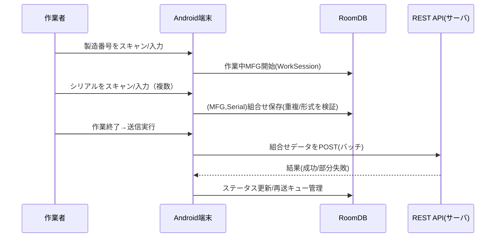

# Androidアプリ設計仕様書（初版）

## 1. 目的・範囲
- **目的**：機能検査工程で読み取った「製造番号（MFG）」と「シリアル番号」を組み合わせ、端末内に保持し、作業終了後にREST APIでサーバーへ送信する。
- **範囲**：端末内データ管理（RoomDB）、スキャン/入力、ローカル検証、送信、エラー再送。サーバー→端末の取得は**行わない**（送信のみ）。

## 2. 非機能要件（抜粋）
- **端末OS**：Android 8.0 (API 26)+ 想定（要件に応じて下げ可）
- **言語/主要ライブラリ**：Kotlin、Room、Retrofit2、OkHttp、Kotlin Coroutines、Hilt、CameraX + ZXing（またはML Kit Barcode）
- **オフライン耐性**：完全オフラインでスキャン・登録可能。送信はオンライン時に実施/再試行。
- **セキュリティ**：通信はHTTPS必須。認証はBearerトークン（JWT等）を想定（運用仕様に合わせて差替可）。端末DBはアプリスコープで保護。

## 3. 画面設計（MVP）
1. **ホーム**
   - 未送信件数/エラー数/最終送信時刻の表示
   - 「製造番号を読む」「シリアルを読む」「一覧・編集」「送信」「設定」ボタン
2. **製造番号スキャン/入力**
   - カメラでQR/バーコード読取（手入力フォールバック）
   - 現在の作業中MFGを保持
3. **シリアル番号スキャン/入力**
   - 現在のMFGに対してシリアルを逐次追加
   - 重複・形式不正は即時ブロック
4. **一覧・編集**
   - MFGごとに紐付いたSerialの表。削除/再スキャン/メモ（任意）編集
5. **送信**
   - バッチ送信（MFG単位/全件）。進捗表示、成功/失敗詳細
6. **設定**
   - エンドポイントURL、トークン、タイムアウト、スキャン挙動（連続スキャンON/OFF）等

> 画面遷移：ホーム →（製造番号）→（シリアル追加）→（一覧）→（送信）→ホーム

## 4. ワークフロー（端末内）

```mermaid
sequenceDiagram
    participant U as 作業者
    participant App as Android端末
    participant DB as RoomDB
    participant API as REST API(サーバ)

    U->>App: 製造番号をスキャン/入力
    App->>DB: 作業中MFG開始(WorkSession)
    U->>App: シリアルをスキャン/入力（複数）
    App->>DB: (MFG,Serial)組合せ保存(重複/形式を検証)
    U->>App: 作業終了→送信実行
    App->>API: 組合せデータをPOST(バッチ)
    API-->>App: 結果(成功/部分失敗)
    App->>DB: ステータス更新/再送キュー管理
```

## 5. 端末内データモデル（Room）
### 5.1 テーブル
- **MfgSerialMapping**
  - `id` (PK, Long, Auto)
  - `mfgId` (Text, NotNull)
  - `serialId` (Text, NotNull)
  - `scannedAt` (Long/Instant, NotNull)
  - `status` (Enum: DRAFT, READY, SENT, ERROR)
  - `errorCode` (Text, Nullable)
  - **UniqueIndex**：`(mfgId, serialId)`  ※定義書要件（MFG×Serial で一意）
- **WorkSession**
  - `sessionId` (PK)
  - `mfgId` (Text)
  - `startedAt` / `endedAt`
  - `note` (Text)
- **Outbox**
  - `outboxId` (PK)
  - `payloadJson` (Text)  // バッチ送信用にスナップショット
  - `createdAt` / `lastTriedAt`
  - `tryCount` (Int)
  - `state` (PENDING, SENDING, DONE, FAILED)

### 5.2 Entity例（Kotlin）
```kotlin
@Entity(
  tableName = "mfg_serial_mapping",
  indices = [Index(value = ["mfgId","serialId"], unique = true)]
)
data class MfgSerialMapping(
  @PrimaryKey(autoGenerate = true) val id: Long = 0,
  val mfgId: String,
  val serialId: String,
  val scannedAt: Long,
  val status: String = "READY",
  val errorCode: String? = null
)
```

## 6. バリデーション
- **形式**：MFG/Serialの書式（桁数・プレフィクス・チェックサム等）がある場合は正規表現/関数で検証。
- **一意性**：端末内で `(mfgId, serialId)` の重複禁止（Roomのunique index＋アプリ側チェック）。
- **入力ソース**：カメラ優先、失敗時は手入力。手入力は二重確認（再入力一致）オプション。

## 7. 送信/同期設計
- **トリガ**：ユーザー操作の「送信」／設定で「自動送信（Wi-Fi時/充電中 等）」任意ON。
- **粒度**：MFG単位のバッチ送信を基本。大量件数はページング/分割。
- **再試行**：指数バックオフ（例：1m, 5m, 15m, 60m）。`HTTP 5xx/ネットワーク例外`は再試行、`4xx`は恒久エラーとして記録。
- **冪等性**：サーバー側が`(mfgId, serialId)`で重複拒否/無害化する前提。クライアントも送信ごとに`requestId(UUID)`を付与。
- **部分失敗**：成功分はSENT、失敗レコードはERRORにしてメッセージ表示＋再送可能。

## 8. API I/F（暫定）
- **共通**：`Authorization: Bearer <token>`、`Content-Type: application/json`
- **POST** `/api/v1/mappings/bulk`
  - **Request**
    ```json
    {
      "requestId": "b9f1-...",
      "deviceId": "AND-12345",
      "mfgId": "MFG-0001",
      "items": [
        {"serialId":"SR-001","scannedAt":"2025-09-19T12:34:56Z"},
        {"serialId":"SR-002","scannedAt":"2025-09-19T12:35:10Z"}
      ]
    }
    ```
  - **Response（例）**
    ```json
    {
      "ok": true,
      "mfgId": "MFG-0001",
      "accepted": 18,
      "rejected": [
        {"serialId":"SR-009","code":"DUPLICATE","message":"already exists"}
      ]
    }
    ```
- **タイムアウト/リトライ**：書込APIは30s目安。クライアントでリトライ（上記再試行ポリシー）。

## 9. 例外・エラーコード（端末内の扱い）
- **ネットワーク**：`NET_UNREACHABLE`, `TLS_ERROR`
- **認証**：`AUTH_INVALID`, `AUTH_EXPIRED`
- **サーバー検証**：`DUPLICATE`, `FORMAT_ERROR`, `POLICY_VIOLATION`
- **再送対象**：`5xx`, `NET_*`／**再送不要**：`DUPLICATE`, `FORMAT_ERROR`

## 10. スキャン仕様
- **QR/バーコード**：QR（モデル2）を推奨。カメラはCameraX、デコードはZXingまたはML Kit。
- **連続スキャン**：ON時は1件完了後に自動で次の読み取り状態へ。バイブ/音は設定可。

## 11. アーキテクチャ
- **構成**：Clean Architecture（Presentation / Domain / Data）
  - Presentation：Activity/Fragment + ViewModel + State
  - Domain：UseCase（`ScanSerial`, `AppendMapping`, `SendMappings` など）
  - Data：Repository（Room/Retrofit実装を切替可能）
- **DI**：Hilt。**I/F分離**でテスト容易化。
- **スレッド**：Coroutines + Flow（DB監視・送信進捗）

## 12. 権限とプライバシー
- **権限**：`CAMERA` のみ（インターネットは通常権限）
- **プライバシー**：個人情報は扱わない想定。端末内データはアプリ内スコープ。バックアップ要否は運用判断。

## 13. ログ/監査
- **操作ログ**：`who/when/what`（スキャン/削除/送信）を端末内に保持。PIIは記録しない。
- **送信ログ**：リクエストID、件数、結果、リトライ回数。

## 14. パフォーマンス/容量
- 1日あたり最大取り扱い件数の想定に応じてDBインデックス最適化。
- 大量スキャン時は書込をバルク化しUIスレッドを阻害しない。

## 15. テスト計画（抜粋）
- **ユニット**：UseCase/Repositoryの正常系/例外系
- **UI**：スキャン誤読、重複、オフライン時の挙動
- **結合**：Room↔Repository↔Retrofitの統合
- **通信**：モックサーバで`2xx/4xx/5xx`とタイムアウト検証

## 16. 設定/運用パラメータ
- エンドポイントURL、認証トークン、再試行回数上限、ログレベル。

## 17. 将来拡張
- 送信ジョブのスケジューラ（WorkManager）強化