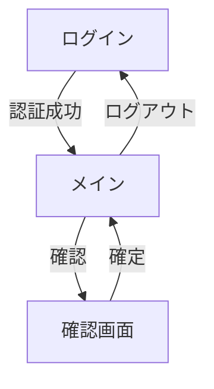

# 設計手順書

## 1. 前提
- **対象工程**：機能検査工程  
- **入力情報**：製造番号（MFG）、シリアル番号（Serial, 複数）  
- **出力**：製造番号－シリアル番号の組み合わせデータをサーバーに送信  
- **使用端末**：キーエンス DX-A800 (Android 13, API 33)  
- **通信方向**：Android → サーバー のみ  
- **サーバーDB**：Oracle 19c（仕様外、本書ではAndroid側設計に集中）

---

## 2. 全体フロー

```mermaid
flowchart TD
    subgraph 機能検査工程
        A1[製造番号を読み取り]
        A2[シリアル番号を読み取り]
        A3[(MFG-Serial)組合せ生成]
        A4[RoomDBに保存]
        A5[REST API経由でサーバ送信]
    end

    A1 --> A2 --> A3 --> A4 --> A5

```
---

## 3. アプリ構成
### 3.1 画面

#### 1.ログイン画面
- ユーザー認証（ID/パスワード）
- 成功でメイン画面へ遷移

#### 2.メイン画面
- 製造番号入力（QR/手入力）
- シリアル番号入力（QR/手入力）
- 確認画面への遷移
- 同期（送信）ボタン
- ステータス表示（未送信件数、エラー件数）

#### 3.確認画面
- MFG × Serial 一覧表示
- 編集／削除
- 確定でRoomDBに保存

### 3.2 画面遷移

---

## 4.データモデル（Room）
### 4.1 テーブル

- MfgSerialMapping
   - id (PK, Auto)
   - mfgId (Text, NotNull)
   - serialId (Text, NotNull)
   - scannedAt (Long/Instant)
   - status (Enum: DRAFT, READY, SENT, ERROR)
   - errorCode (Text, Nullable)
   - UniqueIndex: (mfgId, serialId)

- WorkSession
   - sessionId (PK)
   - mfgId (Text)
   - startedAt / endedAt
   - note (Text)

- Outbox
   - outboxId (PK)
   - payloadJson (Text)
   - createdAt / lastTriedAt
   - tryCount (Int)
   - state (PENDING, SENDING, DONE, FAILED)

---

## 5. バリデーション仕様

- MFG/Serialの書式検証（正規表現）
- (mfgId, serialId) の重複禁止
- 入力はスキャン優先、失敗時のみ手入力（二重確認）

---

## 6. 通信仕様

- 方式：HTTPS + Bearerトークン (JWT)
- API：
   - POST /api/v1/mappings/bulk
   - リクエスト：mfgId, items[serialId, scannedAt]
   - レスポンス：成功数、拒否リスト（DUPLICATE等）
- 再試行：指数バックオフ（1m, 5m, 15m...）
- 冪等性：requestId(UUID)で送信ごとに識別
- 部分失敗：成功分はSENT、失敗はERRORとして再送可能

---

## 6.1 API処理の実装手順

1. **Retrofitインターフェース定義**
   - `@POST("/api/v1/mappings/bulk")` でAPIエンドポイントを指定
   - `Authorization`ヘッダーにBearerトークンを付与

2. **データクラス作成**
   - リクエスト/レスポンス用のKotlinデータクラスを定義

3. **Repository層でAPI呼び出し**
   - suspend関数でAPI呼び出し
   - 成功/失敗をResult型で返却

4. **UseCase層でビジネスロジック管理**
   - Repositoryを呼び出し、結果をViewModelへ返す

5. **ViewModelでUI状態管理・エラーハンドリング**
   - API呼び出し結果に応じてUI更新・再試行処理

6. **再試行・エラー管理**
   - 失敗時はOutboxテーブルに再送キュー追加
   - 再送は指数バックオフで自動/手動対応

---

## 7. アーキテクチャ

- 構成：Clean Architecture
   - Presentation：Activity/Fragment + ViewModel
   - Domain：UseCase（ScanSerial, AppendMapping, SendMappings）
   - Data：Repository（Room / Retrofit 実装切替）
- DI：Hilt
- 非同期処理：Coroutines + Flow

---

## 8. 運用・拡張

- ログ：操作ログ（スキャン、削除、送信）、送信ログ（requestId, 件数, 結果）
- 権限：
- 将来拡張：WorkManagerによる自動送信ジョブ