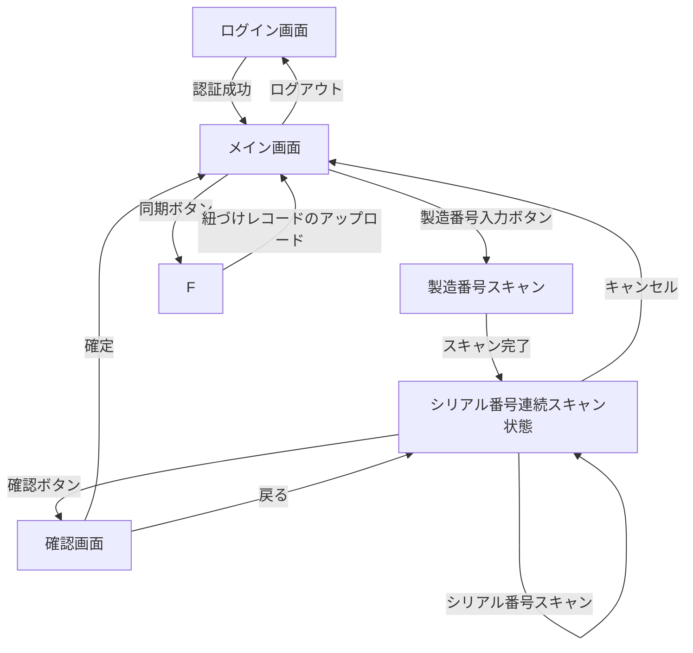

# API設計書

## 1. 画面遷移図

## 2. 同期ボタン押下時の詳細挙動

### 1. データ取得
     - RoomDB の MfgSerialMapping テーブルから status='READY' のレコードを取得する。
     - 製造番号ごとにグルーピング。

### 2. API送信
     - REST API を呼び出し、取得したレコードを外部のDBサーバーに送信する。
     - 1つの製造番号に紐づく全シリアル番号を1トランザクションで登録する。
     - 送信形式: JSON

#### 送信例
      {
    　  "mfgId": "MFG12345",
    　  "serials": [
    　    {"serialId": "SN00001", "scannedAt": "2025-09-30T10:15:30"},
    　    {"serialId": "SN00002", "scannedAt": "2025-09-30T10:16:00"}
    　  ]
    　}

### 3. 送信結果の判定
     - 成功時: status='SYNCED', syncedAtを記録。
     - 失敗時: status='FAILED', RoomDBから再送可能にする。

### 4. ユーザー通知
     - 同期成功件数／失敗件数をダイアログやトーストで通知する。

## 3. パラメータ定義（同期関連を追加）
     - status: String - レコードの状態（READY, SYNCED, FAILED）
     - scannedAt: DateTime - スキャン時刻
     - syncedAt: DateTime - 同期完了時刻（成功時のみ記録

## 4. 同期処理

### 1. オンデマンド処理
#### 1. データ取得
      - RoomDB から status='READY' のレコードを mfgId 単位で取得。

#### 2. API送信（mfg単位トランザクション）
      - 各 mfgId ごとに JSON 形式でサーバーに送信。
      - サーバー側でトランザクション処理。

#### 3. 結果反映
      - 成功：status='SYNCED'、syncedAt 更新。該当レコードを RoomDB から削除。
      - 失敗：status='FAILED' として保持。

#### 4. ユーザー通知
      - 成功／失敗の件数をダイアログまたはトーストで表示。

### 2. バックグラウンド処理
#### 1. トリガー
      - WorkManager で一定間隔（例：1時間ごと）に実行。

#### 2. 処理内容
      - RoomDB の status='READY' および FAILED のレコードを取得。
      - オンデマンド同期と同じ手順で mfgId ごとに送信。

#### 3. 結果反映
      - 成功：status='SYNCED'、syncedAt 更新。該当レコードを RoomDB から削除。
      - 失敗：FAILED のまま保持し、次回再送対象とする。

#### 4. ユーザー通知
      - 通常は通知なし。
      - （拡張予定）条件付き通知を追加する可能性あり。

## 5. API仕様の詳細
    - エンドポイント: REST APIのURL、HTTPメソッド
    - 認証方式: APIキー、Bearer Token、Basic認証など
    - レスポンス形式: 成功/失敗時のレスポンス例
    - エラーコード: HTTP状態コードとエラーハンドリング

## 6. データベーススキーマ
    - MfgSerialMappingテーブル: 全カラム定義（データ型、制約）
    - 外部キー: テーブル間の関連性

## 7. エラーハンドリング
    - ネットワークエラー: タイムアウト、接続失敗時の処理
    - サーバーエラー: 500系エラー時のリトライ戦略
    - データ整合性: 重複送信防止、部分失敗時の対応

## 8. セキュリティ要件
    - データ暗号化: 送信データの暗号化方式
    - 認証情報管理: APIキーやトークンの保存方法
    - 通信プロトコル: HTTP
