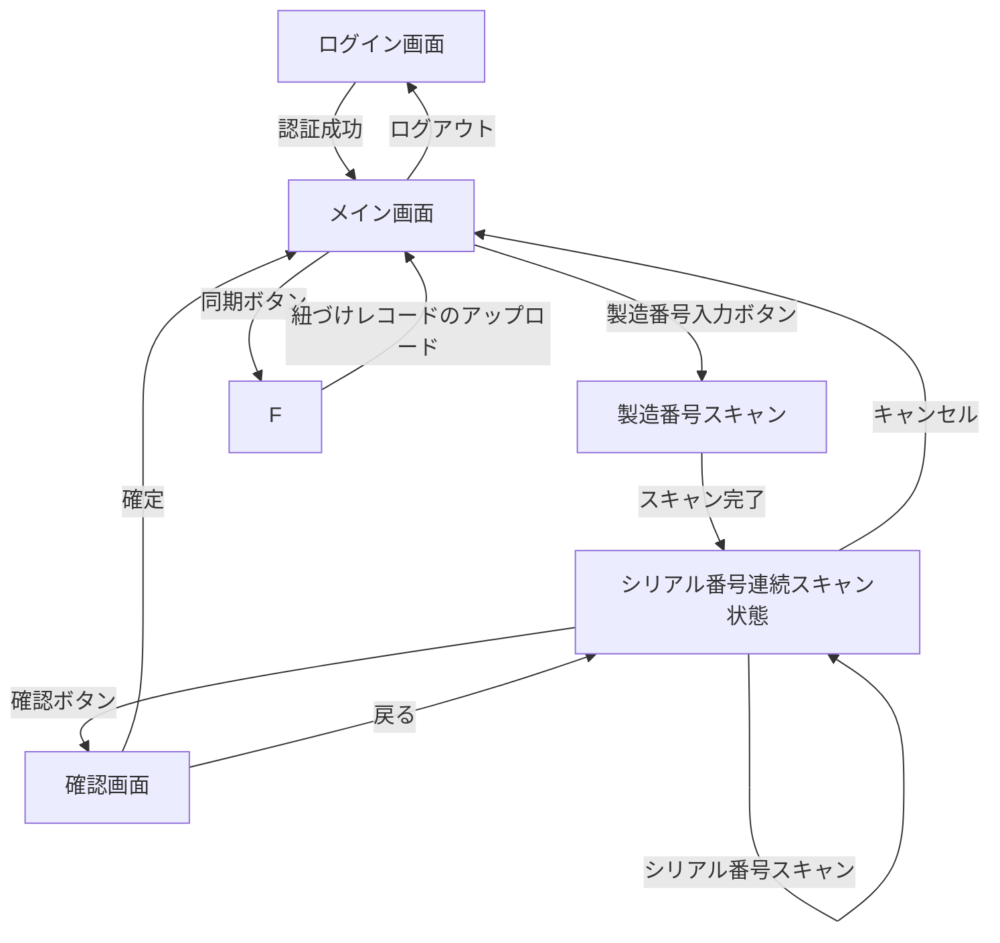

# API設計書

## 1. 画面遷移図

## 2. 同期ボタン押下時の詳細挙動

### 1. データ取得
     - RoomDB の MfgSerialMapping テーブルから status='READY' のレコードを取得する。
     - 製造番号ごとにグルーピング。

### 2. API送信
     - REST API を呼び出し、取得したレコードを外部のDBサーバーに送信する。
     - 1つの製造番号に紐づく全シリアル番号を1トランザクションで登録する。
     - 送信形式: JSON

#### 送信例
      {
    　  "mfgId": "MFG12345",
    　  "serials": [
    　    {"serialId": "SN00001", "scannedAt": "2025-09-30T10:15:30"},
    　    {"serialId": "SN00002", "scannedAt": "2025-09-30T10:16:00"}
    　  ]
    　}

### 3. 送信結果の判定
     - 成功時: status='SYNCED', syncedAtを記録。
     - 失敗時: status='FAILED', RoomDBから再送可能にする。

### 4. ユーザー通知
     - 同期成功件数／失敗件数をダイアログやトーストで通知する。

## 3. パラメータ定義（同期関連を追加）
     - status: String - レコードの状態（READY, SYNCED, FAILED）
     - scannedAt: DateTime - スキャン時刻
     - syncedAt: DateTime - 同期完了時刻（成功時のみ記録

## 4. 同期処理

### 1. オンデマンド処理
データ取得
RoomDB から status='READY' のレコードを mfgId 単位で取得。

API送信（mfg単位トランザクション）
各 mfgId ごとに JSON 形式でサーバーに送信。
サーバー側でトランザクション処理。
成功 → 全件 SYNCED、失敗 → 全件 FAILED。

結果反映
成功：status='SYNCED'、syncedAt 更新。該当レコードを RoomDB から削除。
失敗：status='FAILED' として保持。

ユーザー通知
成功／失敗の件数をダイアログまたはトーストで表示。

### 2. バックグラウンド処理
トリガー
WorkManager で一定間隔（例：1時間ごと）に実行。

処理内容
RoomDB の status='READY' および FAILED のレコードを取得。
オンデマンド同期と同じ手順で mfgId ごとに送信。

結果反映
成功：status='SYNCED'、syncedAt 更新。該当レコードを RoomDB から削除。
失敗：FAILED のまま保持し、次回再送対象とする。

ユーザー通知
通常は通知なし。
（拡張予定）条件付き通知を追加する可能性あり。

