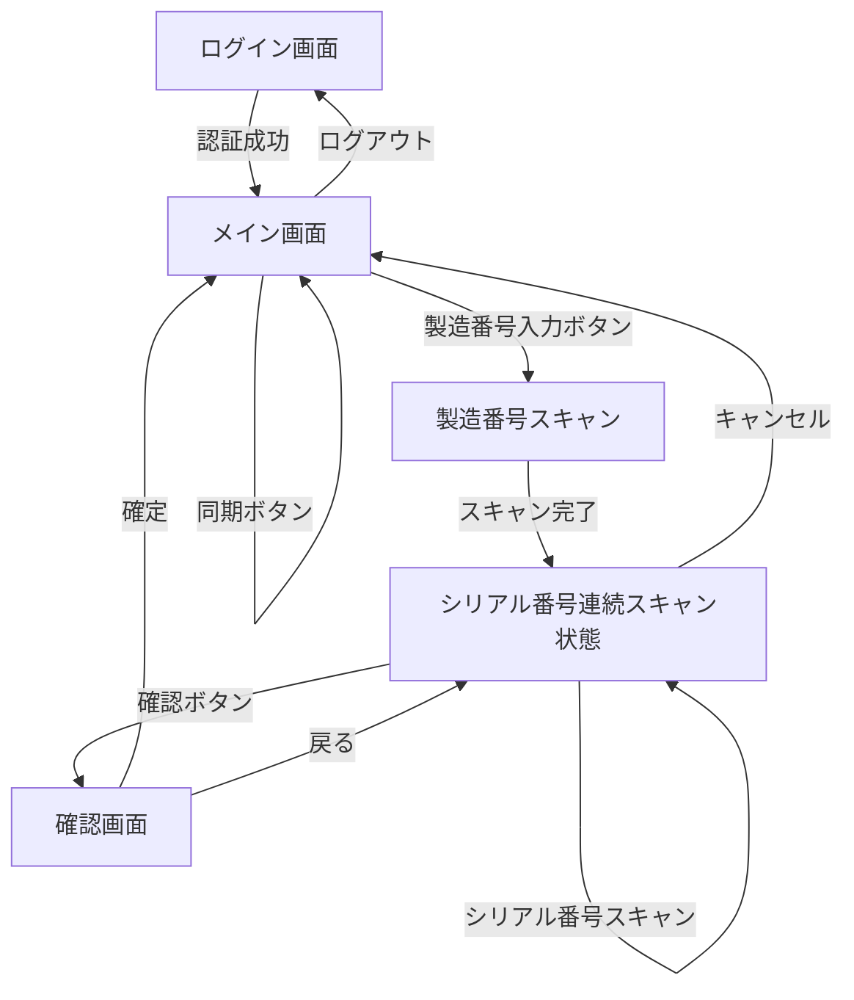

# 画面遷移設計書

## 1. 画面遷移図



## 2. 画面遷移の詳細

### 2.1 ログイン画面 (LoginActivity)
- **遷移元**: アプリ起動時、ログアウト時
- **遷移先**: メイン画面（認証成功時）
- **パラメータ**: なし
- **バックスタック**: 破棄（戻るボタンでアプリ終了）

### 2.2 メイン画面 (MainActivity)
- **遷移元**: ログイン成功時、確認画面からの戻り、キャンセル時
- **遷移先**: 
  - 製造番号スキャン（製造番号入力ボタン押下時）
  - ログイン画面（ログアウト時）
- **パラメータ**: なし
- **バックスタック**: 通常の戻る動作（前の画面に戻る）

### 2.3 製造番号スキャン状態
- **遷移元**: メイン画面（製造番号入力ボタン押下時）
- **遷移先**: シリアル番号連続スキャン状態（スキャン完了時）
- **パラメータ**: スキャンした製造番号 (mfgId)
- **動作**: ダイアログまたはオーバーレイでスキャン画面表示

### 2.4 シリアル番号連続スキャン状態
- **遷移元**: 製造番号スキャン完了時
- **遷移先**: 
  - 自分自身（シリアル番号スキャン時）
  - 確認画面（確認ボタン押下時）
  - メイン画面（キャンセル時）
- **パラメータ**: 
  - 製造番号 (mfgId)
  - スキャン済みシリアル番号リスト (serialIds)
- **動作**: シリアル番号を連続でスキャン可能な状態を維持

### 2.5 確認画面 (ConfirmActivity)
- **遷移元**: シリアル番号連続スキャン状態（確認ボタン押下時）
- **遷移先**: 
  - メイン画面（確定時）
  - シリアル番号連続スキャン状態（戻る時）
- **パラメータ**: 
  - 製造番号 (mfgId)
  - シリアル番号リスト (serialIds)
- **バックスタック**: 通常の戻る動作（シリアル番号スキャン状態に戻る）

## 3. インテントの使用方法

### 3.1 ログイン画面 → メイン画面
```kotlin
val intent = Intent(this, MainActivity::class.java)
intent.flags = Intent.FLAG_ACTIVITY_NEW_TASK or Intent.FLAG_ACTIVITY_CLEAR_TASK
startActivity(intent)
finish()
```

### 3.2 メイン画面 → 確認画面
```kotlin
val intent = Intent(this, ConfirmActivity::class.java).apply {
    putExtra(EXTRA_MFG_ID, mfgId)
    putStringArrayListExtra(EXTRA_SERIAL_IDS, ArrayList(serialIds))
}
startActivityForResult(intent, REQUEST_CODE_CONFIRM)
```

### 3.3 確認画面 → メイン画面（確定時）
```kotlin
val resultIntent = Intent().apply {
    putExtra(EXTRA_IS_CONFIRMED, true)
    putStringArrayListExtra(EXTRA_CONFIRMED_SERIAL_IDS, ArrayList(confirmedSerials))
}
setResult(Activity.RESULT_OK, resultIntent)
finish()
```

### 3.4 確認画面 → メイン画面（キャンセル時）
```kotlin
setResult(Activity.RESULT_CANCELED)
finish()
```

## 4. 定数定義

```kotlin
// リクエストコード
const val REQUEST_CODE_CONFIRM = 1001

// インテントエクストラキー
const val EXTRA_MFG_ID = "extra_mfg_id"
const val EXTRA_SERIAL_IDS = "extra_serial_ids"
const val EXTRA_IS_CONFIRMED = "extra_is_confirmed"
const val EXTRA_CONFIRMED_SERIAL_IDS = "extra_confirmed_serial_ids"
```

## 5. 注意事項

1. 画面回転時の状態保持には `ViewModel` と `SavedStateHandle` を使用する
2. 非同期処理中の画面回転には `Loaders` または `ViewBinding` を使用する
3. バックスタックの管理には `NavController` の使用を推奨（今後の拡張時）
4. デバッグ時は `adb shell dumpsys activity` でバックスタックを確認する
