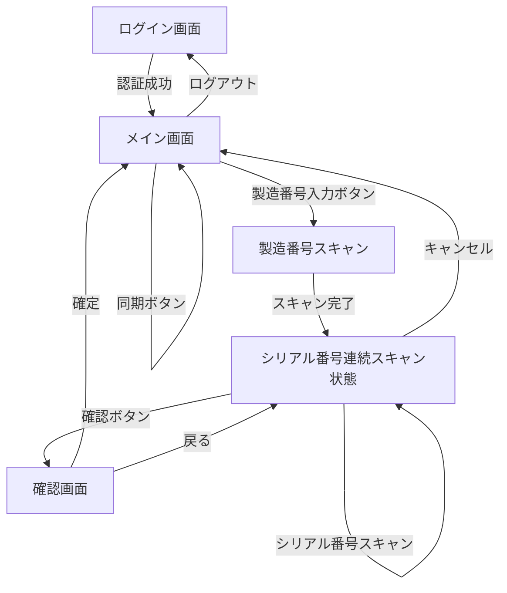

# 画面遷移設計書

## 1. 画面遷移図



## 2. 画面遷移の詳細

### 2.1 ログイン画面 (LoginActivity)
- **遷移元**: アプリ起動時、ログアウト時
- **遷移先**: メイン画面（認証成功時）
- **パラメータ**: なし
- **バックスタック**: 破棄（戻るボタンでアプリ終了）

### 2.2 メイン画面 (MainActivity)
- **遷移元**: ログイン成功時、確認画面からの戻り、キャンセル時
- **遷移先**: 
  - 製造番号スキャン（製造番号入力ボタン押下時）
  - ログイン画面（ログアウト時）
- **パラメータ**: なし
- **バックスタック**: 通常の戻る動作（前の画面に戻る）

### 2.3 製造番号スキャン状態
- **遷移元**: メイン画面（製造番号入力ボタン押下時）
- **遷移先**: シリアル番号連続スキャン状態（スキャン完了時）
- **パラメータ**: スキャンした製造番号 (mfgId)
- **動作**: ダイアログまたはオーバーレイでスキャン画面表示

### 2.4 シリアル番号連続スキャン状態
- **遷移元**: 製造番号スキャン完了時
- **遷移先**: 
  - 自分自身（シリアル番号スキャン時）
  - 確認画面（確認ボタン押下時）
  - メイン画面（キャンセル時）
- **パラメータ**: 
  - 製造番号 (mfgId)
  - スキャン済みシリアル番号リスト (serialIds)
- **動作**: シリアル番号を連続でスキャン可能な状態を維持

### 2.5 確認画面 (ConfirmActivity)
- **遷移元**: シリアル番号連続スキャン状態（確認ボタン押下時）
- **遷移先**: 
  - メイン画面（確定時）
  - シリアル番号連続スキャン状態（戻る時）
- **パラメータ**: 
  - 製造番号 (mfgId)
  - シリアル番号リスト (serialIds)
- **バックスタック**: 通常の戻る動作（シリアル番号スキャン状態に戻る）

## 3. 確認ボタン押下時の詳細挙動

### 3.1 確認ボタンが押されたとき
1. **データ検証**: スキャンした製造番号とシリアル番号リストの妥当性チェック
2. **重複チェック**: データベース内で (mfgId, serialId) の組み合わせが重複していないか確認
3. **確認画面への遷移**: 
   - 製造番号 (mfgId) をパラメータとして渡す
   - シリアル番号リスト (serialIds) をパラメータとして渡す
   - 確認画面 (ConfirmActivity) を起動

### 3.2 確認画面での表示内容
- **一覧表示**: MFG × Serial の組み合わせを表形式で表示
- **編集機能**: 個別レコードの削除が可能（任意）
- **確定ボタン**: データをRoomDBに保存してメイン画面に戻る
- **戻るボタン**: 変更を破棄してシリアル番号スキャン状態に戻る

### 3.3 確定ボタン押下時の処理
1. **データ保存**: MfgSerialMappingテーブルにstatus='READY'で保存
2. **状態更新**: 各レコードにscannedAt（スキャン時刻）を記録
3. **画面遷移**: メイン画面に戻る
4. **状態リセット**: 製造番号とシリアル番号リストをクリア

## 4. パラメータ定義

### 確認画面へのパラメータ
- `mfgId`: String - 製造番号
- `serialIds`: List<String> - シリアル番号リスト

### 確認画面からの戻り値
- `isConfirmed`: Boolean - 確定されたかどうか
- `confirmedSerials`: List<String> - 確定されたシリアル番号リスト
setResult(Activity.RESULT_CANCELED)
finish()
```

## 4. 定数定義

```kotlin
// リクエストコード
const val REQUEST_CODE_CONFIRM = 1001

// インテントエクストラキー
const val EXTRA_MFG_ID = "extra_mfg_id"
const val EXTRA_SERIAL_IDS = "extra_serial_ids"
const val EXTRA_IS_CONFIRMED = "extra_is_confirmed"
const val EXTRA_CONFIRMED_SERIAL_IDS = "extra_confirmed_serial_ids"
```

## 5. 注意事項

1. 画面回転時の状態保持には `ViewModel` と `SavedStateHandle` を使用する
2. 非同期処理中の画面回転には `Loaders` または `ViewBinding` を使用する
3. バックスタックの管理には `NavController` の使用を推奨（今後の拡張時）
4. デバッグ時は `adb shell dumpsys activity` でバックスタックを確認する
